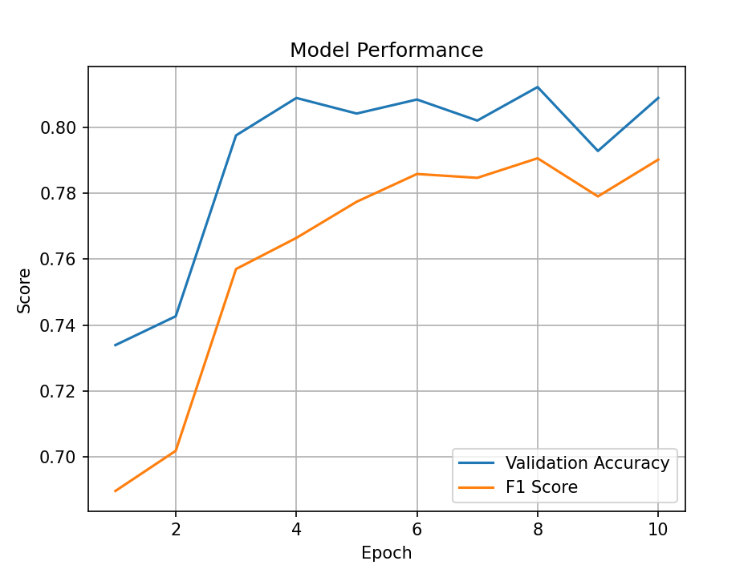
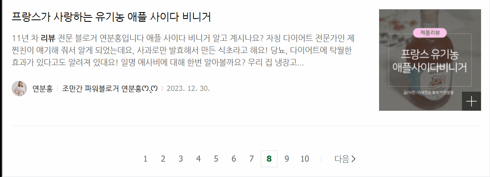
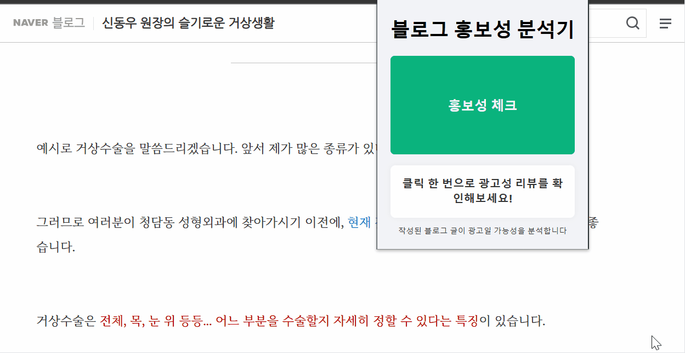

# Blog Review Checker

> 본 프로젝트는 연구 및 교육 목적으로 개발되었으며, 크롤링 대상은 로그인 없이 접근 가능한 네이버 블로그의 공개 포스트입니다. 네이버의 서비스 약관 및 robots.txt를 존중하며, 대량 트래픽을 유발하는 방식으로 사용하지 마십시오.

## 목차

1. [프로젝트 개요](#-프로젝트-개요)
2. [기술 스택](#-기술-스택)
3. [디렉토리 구조](#-디렉토리-구조)
4. [크롤링](#-크롤링)
5. [전처리 및 모델 학습](#-전처리-및-모델-학습)
6. [서버 구성](#-서버-구성)
7. [클라이언트 구성 및 주요 기능](#-클라이언트-구성-및-주요-기능)
8. [로컬 실행 및 확장 프로그램 설치](#-로컬-실행-및-확장-프로그램-설치)
9. [실제 사용 화면 예시](#-실제-사용-화면-예시)
10. [참고 자료](#-참고-자료)

## 프로젝트 개요

블로그 글의 홍보성 여부를 판단하는 **크롬 확장 프로그램**입니다.  
네이버 블로그에서 리뷰 글을 확인할 때,  
해당 글이 **홍보성** 인지 여부를 AI 기반으로 분석하여 시각적으로 표시해줍니다.

- 블로그 링크에 **마우스 우클릭** → `홍보성 체크` 메뉴 제공
- 블로그 상세 페이지에서 **팝업 버튼 클릭**으로 홍보성 분석 가능
- 분석 결과를 **실시간으로 시각화**하여 사용자에게 표시
- **Flask 백엔드**에서 크롤링 및 KoBERT 기반 AI 모델로 예측 수행
- 프론트엔드는 **Context Menu, 팝업, DOM 조작**을 포함하여 사용자 경험 중심의 UI 구성

> 본 프로젝트는 **한국컴퓨터정보학회 2024 하계학술대회**에 논문으로 출품 및 발표되었습니다.

## 기술 스택

### 프론트엔드

- **Vanilla JavaScript (ES Modules)**
- **Chrome Extension (Manifest v3)**
- **esbuild**

### 백엔드

- **Flask**
- **CORS**, **Blueprint**
- **Playwright**

### AI 모델 및 데이터 처리

- **BeautifulSoup**, **Selenium** (초기 데이터 수집용)
- **Okt (KoNLPy)** (형태소 분석 및 전처리)
- **KoBERT**, **Transformers (Hugging Face)** (텍스트 분류 모델)
- **PyTorch**, **scikit-learn**, **pandas**, **numpy** (모델 학습 및 평가)

## 디렉토리 구조

```bash
AD-CHECK-EXTENSION/
├── client/                        # 크롬 확장 프로그램 프론트엔드
│   ├── background/               # 백그라운드 서비스 워커
│   ├── content/                  # 컨텐츠 스크립트
│   ├── dist/                     # 번들 결과물 (esbuild 출력)
│   ├── popup/                    # 팝업 UI 관련 파일
│   │   ├── popup.html
│   │   ├── popup.js
│   │   └── popup.css
│   ├── scripts/                  # 주요 로직 스크립트
│   │   ├── api/                  # 서버 API 요청
│   │   ├── constants/            # 상수 정의
│   │   ├── handlers/             # 메시지 핸들링
│   │   └── ui/                   # UI 유틸 함수
│   ├── manifest.json             # 크롬 확장 설정
│   ├── package.json
│   └── package-lock.json

├── crawling/                     # 블로그 크롤링 관련 코드
│   ├── images/                   # 수집된 이미지 (생략 가능)
│   └── blog_crawler.py           # Playwright 기반 블로그 크롤러

├── data/                         # 데이터셋 저장 디렉토리
│   ├── model_save/               # 학습된 모델 저장 경로
│   ├── output.csv                # 원본 출력 CSV
│   └── processed_output.csv      # 전처리된 CSV 파일

├── preprocessing/                # 텍스트 전처리 및 학습 스크립트
│   ├── kobert_tokenizer/         # KoBERT 토크나이저
│   ├── kobert_train.py           # 모델 학습 스크립트
│   └── preprocess_for_kobert.py  # 전처리 파이프라인

├── server/                       # 백엔드 서버 (Flask)
│   ├── app/                      # 라우터 및 서비스 모듈
│   └── run.py                    # 서버 실행 진입점

├── .gitignore
└── README.md
```

## 크롤링

네이버 블로그 리뷰 6,936건을 수집해 학습 데이터를 구축했습니다.  
Selenium과 BeautifulSoup을 활용해 게시글 본문, 제목, 댓글 수 등을 추출하고,  
Clova OCR API를 통해 이미지 속 문구까지 분석에 활용했습니다.

- **수집 항목**: 제목, 본문, 이미지 텍스트(OCR), 댓글 수, 공감 수 등
- **광고 키워드 기반 분류**: `협찬`, `지원`, `제공`, `소정의` 등 포함 여부
- **저장 경로**: `data/output.csv`
- **스크립트 위치**: `crawling/blog_crawler.py`

> 수집된 데이터는 전처리 후 KoBERT 모델 학습에 사용됩니다.

## 전처리 및 모델 학습

수집한 블로그 리뷰 데이터를 전처리하여 **KoBERT 기반 분류 모델** 학습에 활용했습니다.

- **전처리**

  - 형태소 분석기 `Okt`로 본문, 제목, OCR 텍스트를 정제 및 토큰화
  - 불용어 제거 및 세 항목(`title`, `ocr_data`, `content`) 결합 → `combined_text`
  - 전처리 결과는 `processed_output.csv`에 저장

- **모델 학습**
  - 사전학습 모델: `monologg/kobert`
  - KoBERT 입력 포맷으로 변환 (input_ids, attention_mask, token_type_ids)
  - 클래스 불균형을 고려해 가중치 적용한 `CrossEntropyLoss` 사용
  - 최종 모델과 토크나이저는 `data/model_save/` 디렉토리에 저장

> 모델 학습 코드는 `kobert_train.py`, 전처리 코드는 `preprocessing.py`에 포함되어 있습니다.

### 모델 성능

<p align="center">

</p>

- **Validation Accuracy**: 최고 0.81
- **F1 Score**: 최고 0.79 (macro average 기준)

## 서버 구성

Flask 기반 서버는 크롤링, 전처리, 추론 기능을 REST API로 제공합니다.  
클라이언트는 이 API를 통해 블로그 리뷰 내용을 분석 요청합니다.

### 주요 라우트

- `POST /fetch_from_outer`

  - 블로그 링크를 받아 Playwright로 크롤링
  - 제목/본문/이미지 OCR 포함 내용 구성 후 모델 추론

- `POST /fetch-from-inner`

  - 팝업 내에서 iframe DOM 추출 후 제목, 본문, 이미지 URL 전달
  - 서버에서는 이미지 OCR 수행 후 결합 텍스트 생성 및 추론

- 결과: `predictions`, `probabilities` 반환

## 클라이언트 구성

크롬 확장 프로그램의 `manifest v3` 환경에서는 ESM을 직접 사용하지 못하고, `service_worker`나 `content_script`에 **직접 import/export 문법을 사용할 수 없습니다**.  
이 문제를 해결하기 위해 **ESBuild를 사용해 모든 모듈을 번들링**한 후 실행하는 구조를 선택했습니다.

### 주요 폴더 설명

- `background/`

  - `background.js`: 우클릭 메뉴로 링크를 분석 요청하는 service worker 코드

- `content/`

  - `content.js`: 실제 블로그 페이지 DOM을 읽고, 텍스트/이미지 데이터를 추출함

- `popup/`

  - `popup.js`: 사용자 인터랙션을 처리하고 `content.js`에 메시지를 전달
  - `handlers.js`, `utils.js`: UI 업데이트와 메시지 응답 처리 로직

- `scripts/`  
  관심사 분리를 위한 모듈화 폴더

  - `api/`: 서버와 통신하는 fetch 요청 함수
  - `constants/`: 상수 (이벤트 타입, 메시지 등)
  - `handlers/`: 메시지 핸들러 함수
  - `ui/`: DOM 조작 유틸 함수

- `dist/`  
  ESBuild로 번들된 최종 실행 파일 저장소
  - `background.bundle.js`
  - `content.bundle.js`
  - `popup.bundle.js`

### 번들링 스크립트

```json
"scripts": {
  "build:content": "esbuild client/content/content.js --bundle --outfile=client/dist/content.bundle.js",
  "build:background": "esbuild client/background/background.js --bundle --outfile=client/dist/background.bundle.js --format=esm",
  "build:popup": "esbuild client/popup/popup.js --bundle --outfile=client/dist/popup.bundle.js",
  "build": "npm run build:content && npm run build:background && npm run build:popup"
}
```

번들링된 `.bundle.js` 파일은 `manifest.json`에서 실행 스크립트로 등록됩니다.

```json
"background": {
  "service_worker": "dist/background.bundle.js",
  "type": "module"
},
"content_scripts": [
  {
    "matches": ["<all_urls>"],
    "js": ["dist/content.bundle.js"]
  }
],
"action": {
  "default_popup": "popup/popup.html"
}
```

## 로컬 실행 및 확장 프로그램 설치

아래 단계에 따라 클라이언트와 서버를 실행하고, 크롬 확장 프로그램을 설치할 수 있습니다.

---

### 1. 프로젝트 클론 및 설치

**전체 프로젝트 클론 후 이동:**

```bash
git clone https://github.com/your-username/blog-review-checker.git
cd blog-review-checker
```

**클라이언트 설치 및 번들링:**

```bash
cd client
npm install
npm run build
#ESBuild로 번들링된 결과물(popup.bundle.js, background.bundle.js, content.bundle.js)이 dist/ 디렉토리에 생성
```

**서버 설치:**

```bash
cd ../server
python -m venv venv
source venv/bin/activate (Windows는 venv\Scripts\activate)
pip install -r requirements.txt
```

---

### 2. SSL 인증서 발급

HTTPS 실행을 위해 인증서가 필요합니다.
테스트용 인증서는 다음 명령어로 생성할 수 있습니다:

```bash
openssl req -x509 -newkey rsa:4096 -nodes -keyout ssl/key.pem -out ssl/cert.pem -days 365
```

※ 인증서는 server/ssl/ 디렉토리에 위치해야 합니다.

---

### 3. 데이터 수집 및 전처리

- 블로그 크롤링: python blog_crawler.py
- 전처리 및 라벨 처리: python preprocess_for_kobert.py

※ 이 과정을 통해 data/processed_output.csv 가 생성되어야 예측이 가능합니다.

---

### 3-1. 모델 다운로드 및 배치

GitHub의 용량 제한으로 인해 학습된 KoBERT 모델 파일은 별도로 제공됩니다.  
아래 링크에서 다운로드 후 지정된 경로에 위치시켜 주세요:

- [모델 다운로드 (pytorch_model.bin)](https://drive.google.com/uc?id=12Wh4CQseMiOjH6o5XmfMJpyTjjX8445L)

**자동 다운로드 명령어:**

```bash
pip install gdown
gdown https://drive.google.com/uc?id=12Wh4CQseMiOjH6o5XmfMJpyTjjX8445L -O data/model_save/pytorch_model.bin
```

### 4. 서버 실행

- python run.py
  기본 주소: https://localhost:3000

---

### 5. 크롬 확장 프로그램 설치

1. 크롬 주소창에 chrome://extensions 입력
2. 우측 상단 **개발자 모드** 활성화
3. **압축 해제된 확장 프로그램 로드** 클릭
4. client/ 디렉토리 선택

---

### 6. 사용 방법

- 블로그 목록에서 마우스 우클릭 → `홍보성 체크`
- 블로그 상세 페이지에서 확장 프로그램 팝업 → 버튼 클릭
- 분석 결과는 블로그 글 옆 배지 또는 팝업으로 표시됩니다.

## 실제 사용 화면 예시

Chrome 확장 프로그램을 통해 분석 기능을 수행하면 아래와 같은 방식으로 블로그 글 옆에 시각적인 결과가 표시됩니다:

- 우클릭 메뉴를 통해 특정 블로그 링크에 대해 **"홍보성 체크"** 를 수행
- 팝업에서 **"홍보성 체크"** 버튼 클릭 시 현재 탭의 블로그 내용을 분석

분석 결과:

|       블로그 목록에 표시되는 결과       |       분석 팝업에 표시되는 결과       |
| :-------------------------------------: | :-----------------------------------: |
|  |  |

## 참고 자료

- [한국컴퓨터정보학회 2024 하계학술대회 논문 보기 (DBpia)](https://www.dbpia.co.kr/journal/articleDetail?nodeId=NODE11926115)
- [발표자료 PDF 보기](./paper/KoBERT_project_pt.pdf)
